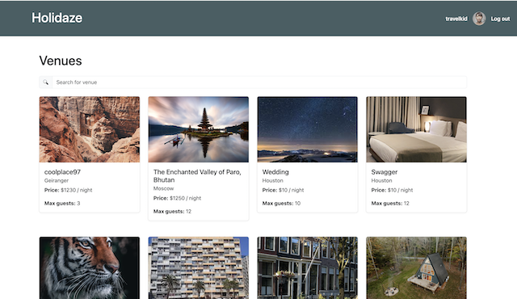

# Holidaze - Project Exam 2

## 📸 Skjermbilde

## Built with

- HTML

- CSS Framework/Bootstrap

- JavaScript

- React/Vite

## Goal

To take the skills learned over the last two years and take on an extensive project where the finished product should reflect the general development capabilities, in addition to visual and technical skills.

## Brief

A newly launched accommodation booking site called Holidaze has approached you to develop a brand new front-end for their application. While they have a list of required features, the design and user experience has not been specified. Working with the official API documentation, plan, design and build a modern front-end accommodation booking application.
There are two aspects to this brief: the customer-facing side of the website where users can book holidays at a venue, and an admin-facing side of the website where users can register and manage venues and bookings at those venues.

## Terminology

Visitor – a user who has not registered or logged in.

Customer – a user who has registered and logged in as a customer.

Venue Manager – a user who has registered and logged in as a Venue Manager.

## User Stories

All users:

- May view a list of Venues.

- May search for a specific Venue.

- May view a specific Venue page by id.

- May register as a customer with a stud.noroff.no email address and password.

- May register as a Venue Manager with a stud.noroff.no email address and password.

- May view a calendar with available dates for a Venue. Should dates be booked this must be indicated within the calendar.

Customers:

- May login and log out once registered.

- May create a booking at a Venue.

- May view their upcoming bookings.

- May update their avatar/profile picture (a placeholder avatar/profile picture may be provided as a default until the customer updates it).

Venue Managers:

- May login and log out once registered.

- May create a Venue.

- May edit/update a Venue they manage.

- May delete a Venue they manage.

- May view upcoming bookings made at a Venue they manage.

- May update their avatar/profile picture (a placeholder avatar/profile picture may be provided as a default until the Venue Manager updates it).

## Installing

- Clone the repo

https://github.com/elinkrull/project-exam-2

- Install dependencies

<pre>npm install</pre>

## Running

- Type in terminal

<pre>npm run dev</pre>

## Live website on Netlify:

https://holidaze-project-exam-2-etj.netlify.app/

## Contact

Elin Thoen Jakobsen
(eth_86@hotmail.com)
